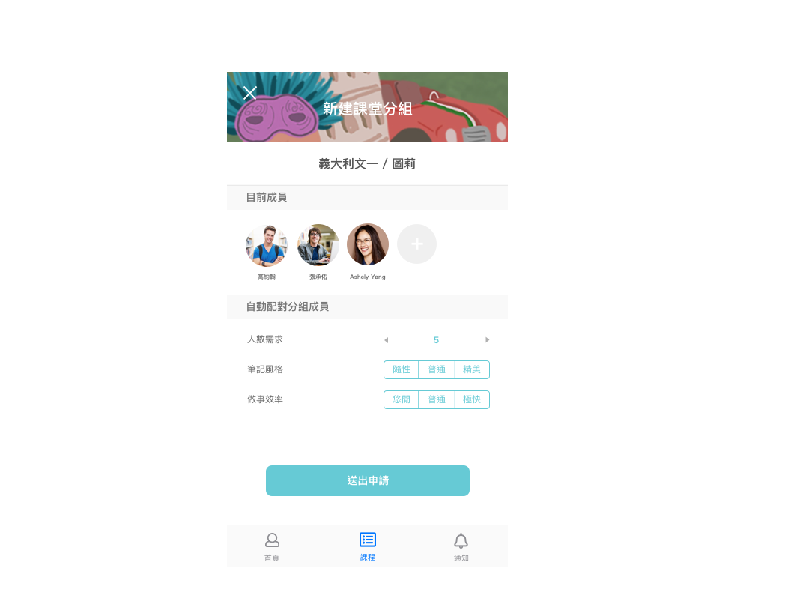
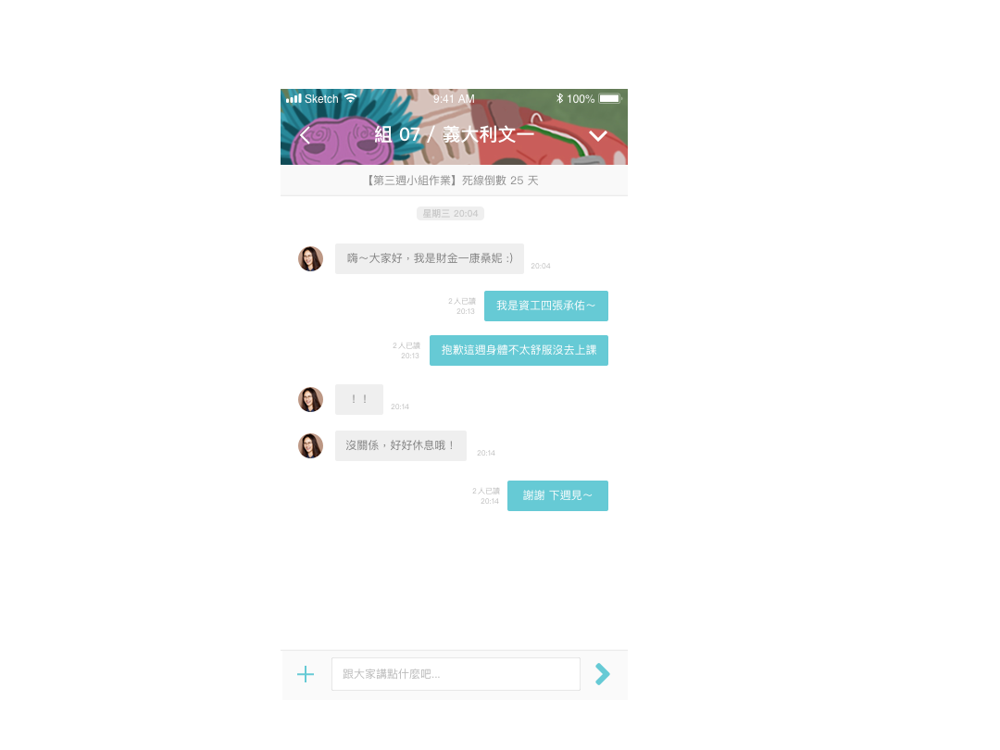

### All Section


* 網站樣板來源：Templatemo http://www.templatemo.com/tm-493-snapshot
* 捨棄樣板配色(灰/粉)而修改了整個網站的視覺色，變成更適合自己的莫蘭迪/大地色系，營造低調幹練的感覺。
* 修改字型為Noto Sans TC。


### Home

* 利用免費素材圖庫，使用更符合自己形象(UX Dreamer)的Slide首圖。

  1. Ideas are brewing.
  2. 做UX設計常用的各種便利貼。
  3. 畫UX設計相關圖常用的文具們。

* 修正樣板預設的My story按鈕(原Learn more)語法及樣式，使其順利跳轉至Introduce區塊。(預設語法有誤無法跳轉)

  html

  ```html
  <input type="button" onclick="javascript:location.href='#about'" class="smoothScroll btn btn-success btn-lg wow fadeInUp" data-wow-delay="1.2s" value="My story"></input>
  ```

  css

  ```css
  .btn-success {
      background: #C9BA9B;
      font-weight: 300;
      letter-spacing: 2px;
      padding: 14px 32px;
      margin-top: 26px;
  }
  ```


### Introduce

* CV部分，Language & Skill下多寫一個div，並利用Figma繪製與整體風格相符的簡約icon，以圖示表達所會的語言/技能更簡單明瞭。(靈感來自手機桌布那份作業)

* Experience部分，修改敘述文字的css樣式，讓它變成更適合中文閱讀。

  ```css
  #about .experience-thumb .description {
    font-size: 12.5px;
    width: 80%;
    margin: 0 auto;
    opacity: 0;
    -webkit-transition: all 600ms cubic-bezier(0.68, -0.55, 0.265, 1.55);
    transition: all 600ms cubic-bezier(0.68, -0.55, 0.265, 1.55);
    -webkit-transform: scale(0);
    -ms-transform: scale(0);
    transform: scale(0);
  }
  ```

  

### Project

* 由於樣板裡這個section本來是相片集，所以這裡的寫法幾乎全部修改讓它變成更適合UX案例的樣子(必須可以呈現較長篇幅的文字)。

* 樣板的圖片呈現方式為靜態+滑鼠移至圖片時彈出文字；在此基礎上，利用slick套件寫slide，移至圖片彈出文字的同時，也可以向右滑輪播圖片，此種方式更適合呈現APP步驟畫面。

* 在文字敘述的小section把每個段落都各寫一個div，以利作排版調整。

html

  ```html
  <ul class="grid cs-style-4">
  	<li class="col-md-12 col-sm-12">
  		<figure>
  		<div>
  			<ul class="project_container">
  			<li></li>
  			<li></li>
  			<li></li>
  			<li></li>
  			<li></li>
  			<li></li>
  			<li></li>
  			<li></li>
  			<li></li>
  			</ul>
  		</div>
  
  	<figcaption>
  		<h1>NTU & ME <small>for 2019 CHISDC</small></h1>
  			<div class="paragraph">
  				<h3>Problem | 降低通識課分組找組員的難度</h3>
  				<p>藉由訪談與研究，了解到對所有年級的台大學生來說，學期初各大通識課的分組報告找不到組員是令他們感到煩惱和尷尬的主要問題之一，並且這個問題會導致上課體驗不佳。</p>
  			</div>
  			 <div class="paragraph">
  				<h3>Solution | APP一鍵配對找組員</h3>
  				<p>設計一款學伴APP，串聯校園系統帳密帶入課程資料，根據偏好設定一鍵分組，降低門檻。並且依據學生們上課最需要的功能，附設共筆小組(串接Google雲端)、帶入課程投影片、通知作業死線、期末自動解散等。
				</p>
  			</div>
			<div class="paragraph">
  				<h3>My Role | 前期用戶研究及產品規劃</h3>
  				<h5>使用者訪談</h5>
  				<p>以「上課時有哪些令你感到不便的地方」為題，針對十多位大一至碩二的台大學生進行訪談，並發現「通識課找不到組員」是大家共同的困境、成為團隊的專案目標。</p>
  				<h5>製作人物誌</h5>
  				<p>製作兩位Persona，性格外向、想從通識課多交朋友的外文系大一系核女孩以及邊緣人、不愛社交只想混過通識趕快畢業的資工大四宅男；代表台大中兩大類型的同學。</p>
  				<h5>繪製各種地圖與User Flow</h5>
  				<P>根據人物誌製作使用者旅程地圖、利害關係人地圖；繪製簡單的互動地圖，並據此畫出User Flow、確定操作邏輯流程，幫助UI experience組員製成Wireframe和簡易Prototype。
  				</P>
  			</div>
  	</figcaption>
  	</figure>
  	</li>
  </ul>
  ```

css

```css
  #project h5 {
    font-size: 13px;
    letter-spacing: 2px;
    FONT-WEIGHT: BOLD;
  }
  
  #project h3 {
    font-size: 16px;
    text-transform: uppercase;
    letter-spacing: 4px;
  }
  
  #project .paragraph {
    padding-bottom: 30px;
  }
  
  .slick-next:before {
      content: '►';
      width: 45px;
      height: 45px;
      color: #C9BA9B;
      position: absolute;
      right: 650%;
  }
```
javascript
  ```javascript
  <script src="js/slick.js"></script>
  <script src="js/slick.min.js"></script>
  
  <script>
      $('.project_container').slick()
   </script>
  ```

  

### Contact

* 此Section樣板只刻了前端外觀，由於沒後端所以完全沒任何功能，因此全部刪除重寫。

* 著手規劃Contact section該如何呈現，希望可以做到這樣：
	1. 個資曝光有點怕怕的所以希望不要直接放上Email。
    2. 使用者可以直接在網頁上就送出訊息給我(自動寄到信箱)，而不用輸入完按送出後還跳出本機的信箱服務器(如outlook)、必須再多按一個步驟才會真正送出。
  
* 這個section花了最多時間查資料和想解法，坊間的解法大部分都是javascript寫mailto，但這不符我上述的第2點期待。後來千辛萬苦終於找到formspree這個第三方插件，可以直接在網頁上掛表單當作聯絡欄並直接寄到網站主人的信箱、也可以利用css自行修改樣式。

  Formspree介紹：https://free.com.tw/formspree/

  html

  ```html
  <form action="https://formspree.io/xjvayodd" method="POST">
  	<label class="text">
  		您的Email
  		<br><input style="width:500px;" type="text" name="_replyto"></br>
  	</label>
  	<label class="text">
  		想說的話
  		<br><textarea style="width:500px;height:200px;" name="message"></textarea></br>
  	</label>
  	<br><button class="submit" type="submit">提交</button></br>
  </form>
  ```

  css

  ```css
  #contact,
  footer {
    background: #D2D5B8;
    color: #ffffff;
  }
  
  #contact .text {
    color: #888;
    letter-spacing: 2px;
  
  }
  
  #contact .submit {
    width: 50px;
    border: none;
    border-radius: 1px;
    background-color: #C9BA9B;
  
  }
  ```


#### Credit

Snapshot Template
http://www.templatemo.com/tm-493-snapshot

Bootstrap
http://getbootstrap.com/

Images
http://unsplash.com/

Zoom Slider
https://vegas.jaysalvat.com/

Caption Hover Effects
http://tympanus.net/codrops/2013/06/18/caption-hover-effects/


Animate CSS
https://daneden.github.io/animate.css/

OwlCarousel
http://www.owlcarousel.owlgraphic.com/

Formspree

https://free.com.tw/formspree/

Slick

https://kenwheeler.github.io/slick/

NTU&ME APP展示圖：我的專案組員Mu Yu

